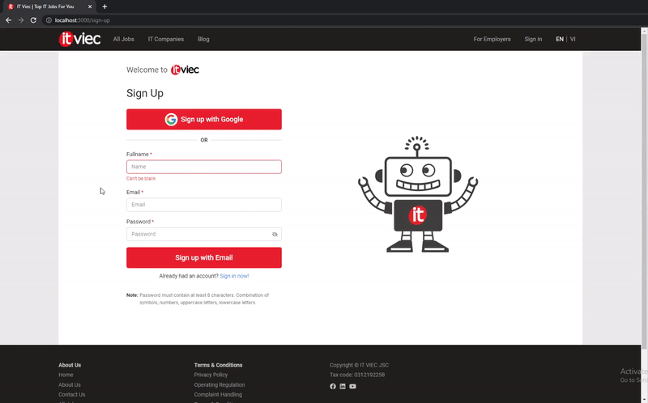
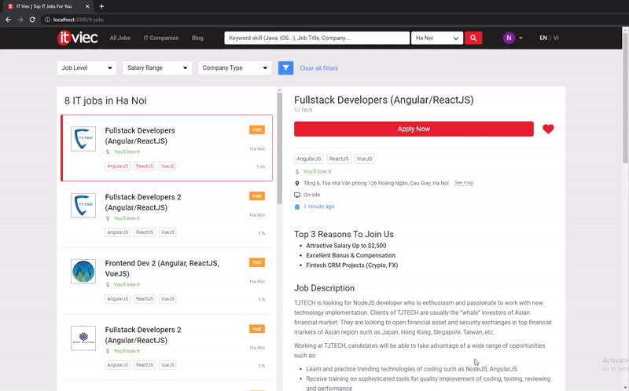
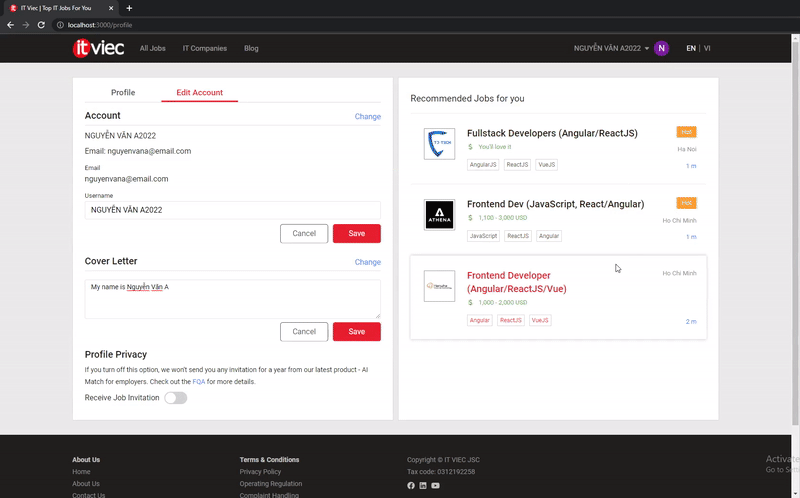
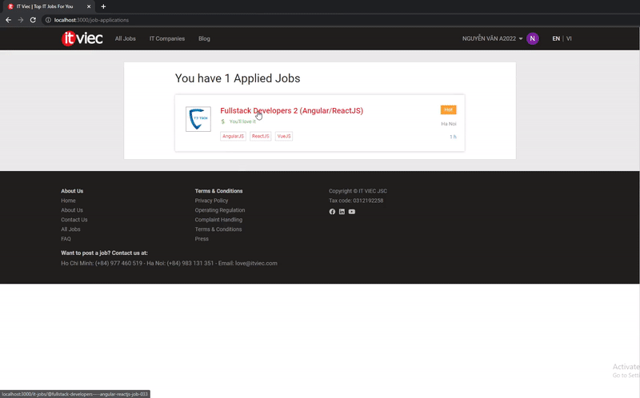

  

# 
ITviec-ui ReactJS

---

## _
A cloning recruitment website based on [www.itviec.com](https://itviec.com/)_ 

## Preview: [https://itviec-ui.vercel.app/](https://itviec-ui.vercel.app/)

## Features:

- Validate form
- Sign up, sign in
- View jobs, company profiles
- Search jobs by
  - _textsearch_
  - _location_
  - _skill_
  - _job title_
  - _company name_
- Filter jobs by:
  - _level_
  - _salary range_
  - _company type_
- View and update profile
- Recommend jobs _(base on user's skills)_
- Apply jobs, save jobs, follow companies, ect.
- Responsive _(desktop, tablet, mobile)_

## Technologies:

- ReactJS
- Redux (+ Toolkit), Redux Thunk, Redux persist
- MirageJS
- SASS
- classnames
- Axios

## Screenshots:

### Sign up, sign in:

### View job and company profile:

### Search and filter jobs:

### Search by skill, job title, location, company name:

### Update profile:

### Subscribe for jobs and companies:

### Save and apply for a job:

